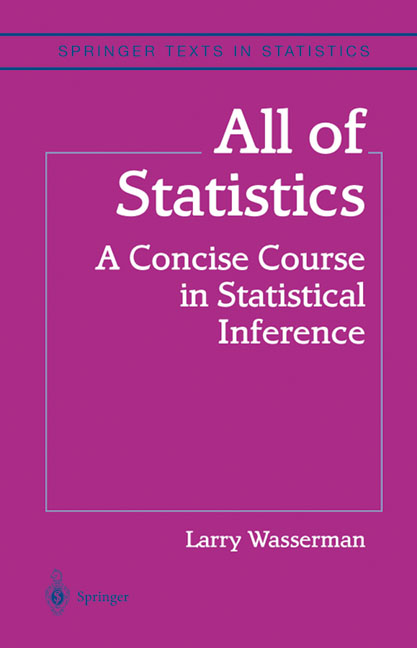

# AOS
All of statistics

## Class Materials

- [Probability and Statistics I](http://www.stat.cmu.edu/~larry/=stat325.01/)
- [Intermediate Statistics by Larry Wasserman](http://www.stat.cmu.edu/~larry/=stat705/)

## Chapter 2. Random Variables

- [Visualizing Distributions](https://github.com/GunhoChoi/AOS/blob/master/distributions/Distributions.ipynb)

## Chapter 9. Parametric Inference

- [Cramer Rao Lower Bound](https://www.youtube.com/watch?v=i0JiSddCXMM , https://www.youtube.com/watch?v=igQIsYAlKlY)
- [MLE Asymptotic Normality](https://ocw.mit.edu/courses/mathematics/18-443-statistics-for-applications-fall-2006/lecture-notes/lecture3.pdf)

## Chapter 10. Hypothesis Testing and p-values

- [Equivalence of two definitions of p-value](https://stats.stackexchange.com/questions/177113/two-definitions-of-p-value-how-to-prove-their-equivalence)

## Others

- [Effective Sample Size](http://www.nowozin.net/sebastian/blog/effective-sample-size-in-importance-sampling.html)
- [Statistical-Rethinking-with-Python-and-PyMC3](https://github.com/aloctavodia/Statistical-Rethinking-with-Python-and-PyMC3)
